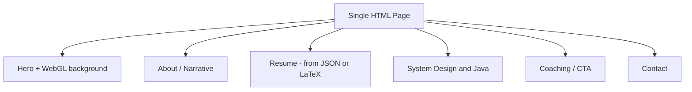

# Personal Website Plan: Staff Architect + Big Tech Public Sector Positioning

## Goal alignment

The site should:

- **Signal to recruiters**: Staff-level system design, Java leadership, enterprise-to–Big Tech narrative (no clearance required).
- **Support your story**: High tenure, architect experience, targeting Public Sector arms (e.g., AWS GovCloud, Google Public Sector, Microsoft Federal) at West Coast comp (~$250k base).
- **Optional**: Position you for Staff-level System Design coaching and Big Tech interview prep for Java leaders (lead gen or "coming soon" CTA).

---

## Constraints and requirements

- **Hosting**: GitHub Pages only — static assets, no backend, no server-side rendering.
- **Structure**: Single page application (one HTML page; all content in sections with anchor navigation or smooth scroll).
- **Performance**: Ultra light — minimal JS, small bundle, fast load.
- **Hero**: WebGL-based fancy background on the front (hero) section.
- **Design**: Modern and clean.
- **Responsive**: Support all device sizes — mobile, tablets, laptops/desktops, Full HD (1920×1080), 4K (3840×2160), and ultra-wide or large monitors; layout, typography, and WebGL must work across viewports.
- **Resume**: Single source of truth (JSON or LaTeX); same content rendered on the page and as a PDF; PDF must be standard, ATS-friendly format.

---

## Recommended tech stack

- **App**: Vanilla JS or Preact (if you want minimal components). Keeps bundle tiny; no React/Vue overhead.
- **Build**: Vite — fast, static output, tree-shaking; ideal for GitHub Pages (`dist/` or `docs/`).
- **Styling**: Plain CSS or Tailwind with strict purge so only used classes are shipped.
- **Hosting**: GitHub Pages — static only; use `gh-pages` branch or `docs/` folder; no backend.
- **WebGL**: Custom WebGL (canvas + shaders) for minimal weight, or three.js if you accept ~50–80KB gzipped for quicker iteration.
- **Toolchain**: Node is available and used for build (Vite), PDF generation (Puppeteer/jsPDF), and any scripts.

**Resume pipeline** (see Resume section below):

- **Source**: One document — **JSON** (recommended) or **LaTeX**.
- **Web**: Render resume section from that source (JS builds DOM from JSON, or build-time step converts LaTeX → HTML).
- **PDF**: Generate at **build time** (no backend): same source → ATS-friendly PDF, committed to repo or emitted in `dist/` so the site can link to `/resume.pdf`.

---

## Site structure: single page

One HTML file; sections are `<section id="...">` with in-page anchors. Navigation: anchor links (e.g. `#about`, `#resume`, `#contact`).




1. **Hero** (above the fold)
  - WebGL fancy background (canvas full-bleed, content on top).
  - One-line positioning; subline (e.g. Public Sector / no clearance).
  - Nav: anchors to About, Resume, System design, Coaching, Contact.
2. **About**
  - Short narrative (tenure, Staff/architect, why Big Tech Public Sector).
3. **Resume**
  - Rendered from **single document** (JSON or LaTeX). Same data as the PDF. CTA: "Download PDF" linking to static `resume.pdf`.
4. **System design & Java**
  - Staff-level system design + Java leadership; optional 1–2 short snippets.
5. **Coaching** (optional)
  - One block + CTA (email / Calendly or "Coming soon").
6. **Contact**
  - Email, LinkedIn, optional Calendly.

---

## Resume: single source, web + ATS-friendly PDF

**Requirement**: One document (JSON or LaTeX) drives both the on-page resume and the PDF. PDF must be in a standard, recruiter- and ATS-friendly format.

**ATS-friendly PDF** (so it passes recruiter filters):

- Text must be real text (selectable), not flattened images.
- Standard fonts (e.g. system or embedded: Arial, Helvetica, Open Sans).
- Clear structure: headings, sections (Experience, Education, Skills), bullet lists.
- No complex layouts or text-in-graphics that parsers can't read.
- Single column or simple two-column; avoid heavy tables for body text.

**Option A — JSON as source (recommended)**

- **Source**: Single `resume.json` (or `data/resume.json`) with structure such as: `name`, `contact`, `summary`, `experience[]`, `education[]`, `skills[]`, etc.
- **Web**: At load or build time, JS (or a small build script) turns JSON into HTML for the Resume section. No backend.
- **PDF**: Generate at **build time** (e.g. in npm script or GitHub Actions):
  - **Puppeteer/Playwright**: Render a print-optimized HTML page (from same JSON), then `page.pdf()`. Output `resume.pdf` into `dist/` or `public/`. Ensures web and PDF match.
  - **jsPDF / React-PDF**: Generate PDF from JSON in Node during build; write `resume.pdf` to output folder.
- Commit `resume.pdf` to the repo or emit it in the build artifact so the site can link to `/resume.pdf` (or `./resume.pdf`).

**Option B — LaTeX as source**

- **Source**: Single `resume.tex` (or similar).
- **PDF**: Run `pdflatex` (or similar) at build time (local or GitHub Actions); output `resume.pdf` to `dist/` or `public/`.
- **Web**: Either (1) use **pandoc** at build time to convert LaTeX → HTML and inject the HTML into the Resume section, or (2) maintain a minimal JSON export from LaTeX (e.g. hand-written or script) and use Option A for the web. True single-source LaTeX → HTML is possible but tooling is heavier.

**Recommendation**: JSON as source + Puppeteer (or jsPDF) at build time for PDF. One data file, one PDF in repo or build output, link from the single-page Resume section.

---

## Design: modern and clean

- **Layout**: Plenty of whitespace, clear hierarchy, readable line length.
- **Typography**: One or two fonts (e.g. system stack or a single webfont); avoid decorative fonts.
- **Colors**: Limited palette; sufficient contrast (WCAG AA) for text.
- **WebGL background**: Subtle (e.g. particles, gradient mesh, or soft motion) so it doesn't overpower the hero copy; ensure text over the canvas remains readable (overlay or blur behind text if needed).

### Responsive: all device types

The site must work well across the full range of viewports:

- **Mobile**: Small phones (e.g. 320px width and up); single column, touch-friendly nav, WebGL scaled or simplified if needed for performance.
- **Tablets**: Portrait and landscape (e.g. 768px–1024px); layout adapts without horizontal scroll; readable line length.
- **Laptops / desktops**: Common resolutions (e.g. 1280×720, 1366×768); comfortable reading width (max-width or container).
- **Full HD (1920×1080)**: No stretched single-line text; content remains in a readable band or centered; WebGL canvas scales appropriately.
- **4K and ultra-wide (e.g. 3840×2160, 2560×1080)**: Use the full screen — no "tape" (single narrow centered column). See strategy below.
- **Implementation**: Viewport meta tag, fluid/relative units and breakpoints (e.g. mobile-first CSS or Tailwind responsive classes), test at key widths; ensure WebGL canvas resizes with window and doesn’t break layout on resize or orientation change.

---

### Ultra-wide strategy: use full screen (no tape)

Do **not** rely on one narrow max-width column in the middle on large/ultra-wide screens. The site should use the whole viewport efficiently:

- **Full-bleed elements**: Hero and WebGL background span 100% width at all breakpoints. Section backgrounds (if any) extend edge-to-edge so the page feels full-width.
- **Wide layout above a breakpoint**: Above a chosen width (e.g. ~1200px or 1400px), switch to a layout that uses horizontal space:
  - **Option A — Side-by-side**: Sticky nav or key info in a left (or right) column with a fixed max-width; main content in the remaining width. Content column can still have a readable max-width for long text, but the nav/sidebar uses the rest.
  - **Option B — Multi-column content**: On ultra-wide, show sections in 2 (or 3) columns where it makes sense (e.g. Resume experience entries, or About + Contact side by side). Keep line length readable per column (e.g. max ~65–75ch per column).
  - **Option C — Edge-anchored content**: Content blocks align to a grid that uses the full width — e.g. alternating left/right alignment of sections, or a wide grid where cards/blocks sit in columns that scale with viewport (CSS Grid with `fr` or `minmax`).
- **Readable text**: Long prose stays in a comfortable line length (e.g. max-width per column); use multiple columns or a constrained content area within the wide layout rather than one line of text across the whole screen.
- **Result**: On ultra-wide, the user sees a composed layout (nav + content, or multi-column sections, or full-width grid) that uses the edges of the screen, not a thin strip in the middle.

---

## Content and messaging guidelines

- **Positioning shift**: The current site positions you as "Full Stack Java8 Developer working in asynchronous Java 8." The new site should replace that with the Staff / system design / Big Tech Public Sector narrative so recruiters see the target level and market.
- **Tone**: Confident, concise, no hype. Senior engineer speaking to senior engineers and recruiters.
- **Keywords** (for SEO and ATS): Staff engineer, system design, Java, architect, scalability, distributed systems, Public Sector, GovCloud, West Coast, remote.
- **Avoid**: Overclaiming clearance work; keep "enterprise" and "public sector scale" without implying IC/DoD.

---

## Testing Strategy: BDD with Playwright and Cucumber.js

To ensure the site is high-quality and works as expected for visitors, the project will adopt a Behavior-Driven Development (BDD) approach using open-source libraries. Tests will be written in Gherkin syntax, which is human-readable and describes the behavior of the site from a user's perspective.

- **Tech Stack**:
  - **Playwright**: An open-source, modern, and capable end-to-end testing framework for automating browser interactions. It will be used to launch the site and simulate user actions like clicks and navigation.
  - **Cucumber.js**: The JavaScript implementation of Cucumber, which allows running automated tests written in Gherkin.
  - **Gherkin**: A plain-language syntax for writing test scenarios.

- **Example Test Scenario (`features/resume.feature`)**:

  ```gherkin
  Feature: Resume Access

    Scenario: A user can download the PDF version of the resume
      Given I am on the homepage
      When I click the navigation link to the "Resume" section
      And I click the "Download PDF" button
      Then a file download for "resume.pdf" should begin
  ```

- **Setup and Execution**:
  - Test files will live in a `features/` directory. Gherkin `.feature` files describe the scenarios, and JavaScript files in `features/step_definitions/` will contain the code that Playwright executes for each step.
  - An `npm` script in `package.json` will be added to run the test suite, for example: `"test": "cucumber-js"`.
  - Tests will be run as part of the CI/CD pipeline to prevent regressions.

---

## SEO and discoverability (single page)

- **Meta**: One set of meta tags (title, description) for the single page; include "Staff engineer system design Java" and "Big Tech Public Sector."
- **Semantic HTML**: One `<h1>` (e.g. in Hero or About); use `<section>`, `<h2>` for each block; optional `<article>` for narrative.
- **Anchors**: Use `#about`, `#resume`, `#system-design`, `#coaching`, `#contact` for deep links and shareability.

---

## GitHub Pages deployment

- **Output**: Build to a folder that GitHub Pages serves (e.g. `dist/` with "Deploy from a branch" → branch `gh-pages` and folder `/`, or `docs/` on `main`).
- **Config**: In repo Settings → Pages, set source to the branch and folder containing `index.html`.
- **No backend**: All assets static; PDF is a static file (`resume.pdf`) in the same deploy.

### Custom domain: saptarshidebnath.com

- **CNAME**: Add a file named `CNAME` (no extension) in the deployed folder (e.g. `dist/` or `docs/`) with a single line: `saptarshidebnath.com`. The build step should copy this into the output so it’s deployed with the site.
- **DNS**: At your domain registrar, add a CNAME record for `saptarshidebnath.com` (or the `www` subdomain you use) pointing to `username.github.io` (replace with your GitHub username). For apex (root) domain, some registrars require A records (e.g. GitHub’s documented IPs) or CNAME flattening; use your registrar’s guidance for “custom domain GitHub Pages.”
- **Base path**: When the site is served at the custom domain root, use base path `/` in Vite (no `base: '/repo-name/'`); only use a subpath if you keep the site under a path like `saptarshidebnath.com/project/`.
- **HTTPS**: In GitHub repo Settings → Pages, after the custom domain is verified, enable **Enforce HTTPS** so the site is served over HTTPS.
- **Replacing the current site**: The new single-page site will replace the existing content at [saptarshidebnath.com](https://saptarshidebnath.com/). No redirect rules are needed unless you have external links to old paths; for a single page, everything lives at `/` and `#section` anchors.

---

## Implementation order (suggested)

1.  **Scaffold & Test Setup**
    *   Vite project (vanilla or Preact); output to `dist/`. Configure for GitHub Pages.
    *   Set up Playwright and Cucumber.js. Create the `features/` directory structure and add the initial `npm` test script.
2.  **Single-page layout & Navigation Test**
    *   One `index.html` with sections: Hero, About, Resume, System design & Java, Coaching, Contact. In-page nav with anchor links.
    *   Write a Gherkin feature to test that navigating to each section works correctly. Implement the step definitions.
3.  **WebGL hero background**
    *   Full-bleed canvas behind hero; minimal shader or lightweight library. Keep it light; ensure text contrast.
4.  **Resume Pipeline & Testing**
    *   Add `resume.json` (or LaTeX); implement web render (JS or build step).
    *   Write a Gherkin feature to test the resume download functionality (as in the example).
    *   Add the build script to generate `resume.pdf` (Puppeteer or jsPDF); put PDF in `dist/`. Add "Download PDF" link and ensure the test passes.
5.  **Content, Styling & Responsive Testing**
    *   Copy for About, System design, Coaching, Contact; modern, clean CSS (or Tailwind with purge).
    *   Implement the responsive layout (breakpoints for mobile, tablet, desktop, Full HD, 4K/ultra-wide).
    *   Write and run tests to verify the layout does not break on different viewport sizes defined in Playwright.
6.  **Polish & Final Tests**
    *   Meta tags, favicon, accessibility (focus, contrast). Enable GitHub Pages.
    *   Run a full regression test suite (all Gherkin features) to ensure all functionality is working.
    *   Manually test on a few key physical devices.
7.  **Custom domain**
    *   Add `CNAME` with `saptarshidebnath.com` to build output; set DNS (CNAME or A records) and enable Enforce HTTPS in repo Settings → Pages.

---

## Out of scope for this plan

- Blog or CMS.
- Auth, payments, or backend. Forms only via mailto or external (Calendly, etc.).
- Actual copywriting; you supply narrative and resume content.

---

## Summary

- **Hosting**: GitHub Pages only; static site, no backend.
- **App**: Single page application (one HTML, sections + anchor nav); ultra light (vanilla JS or Preact, Vite, minimal CSS).
- **Hero**: WebGL-based fancy background; design modern and clean.
- **Responsive**: All device types — mobile, tablet, desktop, Full HD, 4K, ultra-wide; breakpoints, viewport meta, WebGL resize. Ultra-wide: use full screen (no tape) — side-by-side, multi-column, or edge-anchored layout; Node available for toolchain.
- **Resume**: Single source (JSON recommended) → rendered on page + ATS-friendly PDF generated at build time; PDF linked as static file.
- **Next step**: Scaffold Vite project, add single-page sections and WebGL hero, then implement resume JSON + PDF build step.
